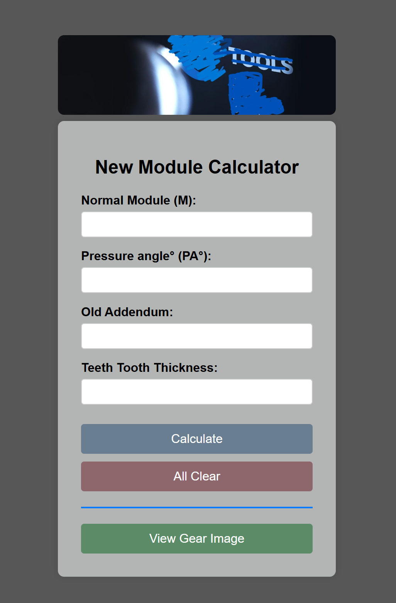

# Gear_Module
I created this project during my time at the company to address a specific issue we encountered while using design software. The existing tools lacked certain features, particularly in handling some design calculations—especially trigonometric transitions—that were being skipped or misaligned between our software and the customer's designs. To resolve this, I developed a simple HTML-based application that performs the necessary trigonometric calculations and provides a user-friendly graphical interface (GUI). I also incorporated features such as gear image generation and company logo integration to enhance usability and presentation.

